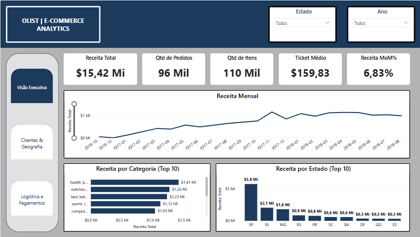
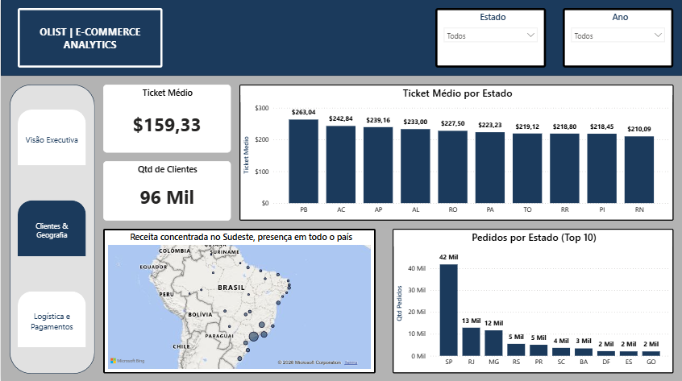
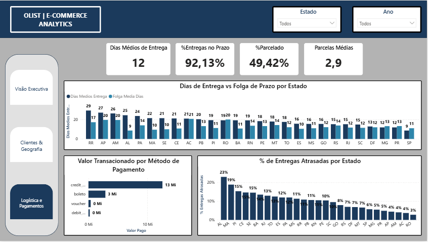

# Olist E-commerce Analytics

Análise de 96 mil pedidos do e-commerce brasileiro (dataset público da Olist, 2016-2018).
Banco modelado em PostgreSQL, análise em SQL e dashboard de 3 páginas em Power BI.

## Stack

- PostgreSQL 18: 9 tabelas, ~1,5 mi de registros, carga via COPY
- Power BI: modelo estrela, 21 medidas DAX, tabela calendário, tema customizado

## O que a análise mostrou

1. A Black Friday de 2017 não foi só um pico. Depois dela a receita mensal subiu de patamar e não voltou mais ao nível anterior.
2. O ticket médio é maior longe dos grandes centros. PB tem ticket de R$ 263 contra R$ 210 de SP. Faz sentido: o frete pesa mais e quem espera 20+ dias por uma entrega só compra o que vale a pena.
3. Alagoas tem 23% de pedidos atrasados, o pior do país. O problema não é distância: estados do Norte com prazos maiores entregam no prazo. Em AL a folga prometida (9 dias) é curta demais para a logística local.
4. Cartão de crédito concentra quase 80% do valor transacionado. Metade das transações é parcelada.

## Decisões de análise

- Só pedidos com status "delivered" entram nas métricas (receita confirmada)
- Meses incompletos do dataset foram excluídos por flag na tabela calendário, senão o gráfico mostra uma queda de receita que não existe
- Clientes contados por customer_unique_id. O customer_id muda a cada pedido e infla a contagem
- As medidas do Power BI foram conferidas contra as queries SQL

## Como reproduzir

1. Baixar o dataset: kaggle.com/datasets/olistbr/brazilian-ecommerce
2. Extrair os CSVs em data/
3. Rodar sql/01_create_tables.sql e depois sql/02_load_data.sql
4. Abrir powerbi/dashboard_olist.pbix e apontar a conexão pro seu PostgreSQL local